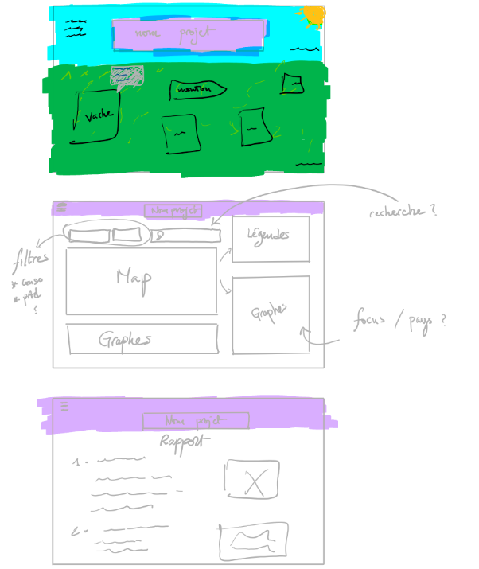

# Proposition d’application - Challenge Open Data 3A
### Jordan Josserand, Florian Cunsolo, Wafi Grissi, Clément Correnoz, Hippolyte Bergeon

## Utilisation

Il faut lancer la commande : 
```python
python3 -m http.server 8000
```

Puis se connecter à [http:localhost:8000](http:localhost:8000)

## Données

Nous partons sur le sujet des viandes dans le monde avec la consommation ainsi que la production et les prix dans le monde. Pour cela, nous allons utiliser plusieurs sources de données : 

- **Prix de la viande dans le monde par mois** entre 1990 et 2020
- **Production de viande par pays** entre 1961 et 2022
- **Consommation de viande par pays** entre 1990 et 2026
- **Impact environnemental** avec l’émission de gaz en 2010 par animaux. Ce jeu de données est sous la licence Creative Commons de Hannah Ritchie, Pablo Rosado et Max Roser (2022) - “Environmental Impacts of Food Production” Published online at OurWorldinData.org. Retrieved from: [OurWorldinData](https://ourworldindata.org/environmental-impacts-of-food) 

Pour la dernière donnée, nous souhaitons avoir votre confirmation de la possibilité de son utilisation dans le projet.

## Interactions

Une page qui aurait :

- Un **input range** pour choisir l’année que l’on souhaite afficher ainsi que 2 boutons pour afficher la consommation et la production.
- Une **carte du monde** avec la production et la consommation de viande par pays. Les pays seront cliquables et mettront à jour les graphiques autour.
- Un **graphique** avec courbe pour la production et la consommation de viandes par année.

Une page pour les prix qui aurait :

- Un **input range** pour choisir l’année 
- Un **graphique camembert** pour afficher la proportion des prix par type de viande en fonction de l’année.
- Un **graphique courbe** pour voir l’évolution des prix des différents types de viande en fonction de l’année.

Une page serait dédiée à une **prairie** avec chaque animal avec un affichage de leur émission de gaz à effet de serre ou consommation d’eau quand on passe la souris au-dessus.

Une page serait dédiée au **rapport détaillé** de la conception du projet, développement et rapport.

## Design

Nous utilisons ici les sources de tailwind générés directement dans le fichier `tailwind.css`.

## Esquisses

Nous avons imaginé cette première version du mockup :
